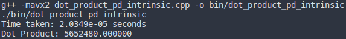

## Ejecucion del producto punto entre dos vectores

### Ejecucion sin optimizaciones vs usando intrinsics.

### Requerimientos del sistema
- Compilador g++ 
- PC con soporte para extension de instrucciones AVX2 (256 bits).

### Ejecucion del codigo

- Para la ejecucion del programa, debe de crearse el directorio **bin**: mkdir bin

- La ejecucion del codigo debe de hacerse desde **dot_product_naive_vs_intrinsics/**

#### Comando para compilar y ejecutar el codigo sin optimizaciones:
- g++ dot_product_naive.cpp -o bin/dot_product_naive
- ./bin/dot_product_naive
  
#### Comando para compilar y ejecutar el codigo con intrinsics:
- g++ -mavx2 dot_product_pd_intrinsic.cpp -o bin/dot_product_pd_intrinsic
- ./bin/dot_product_pd_intrinsic

#### Resultados esperados
Para cada caso se espera obtener el resultado del producto punto junto con el tiempo de ejecucion tomado para realizarlo.

- Output usando intrinsic functions:

- Output sin usar optimizaciones:
